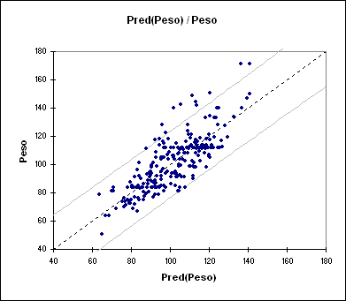
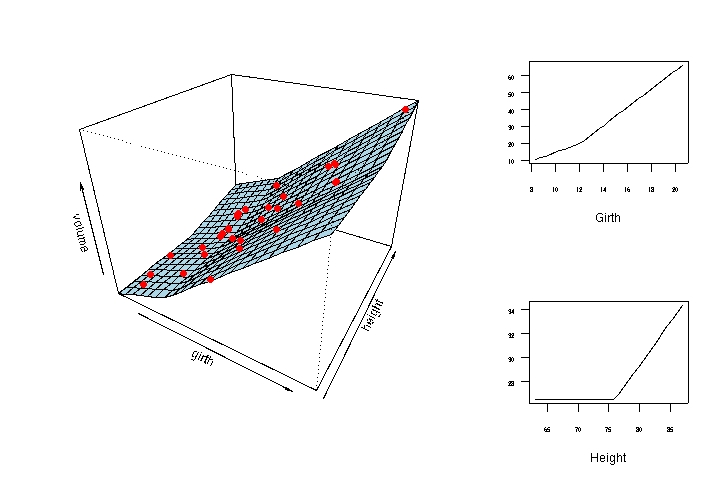
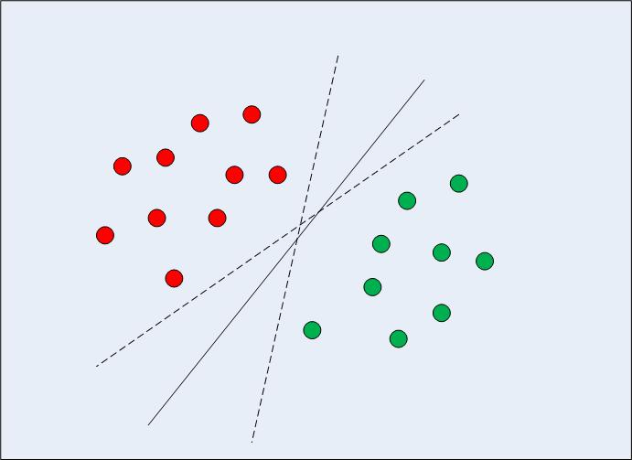

# Intro

## Motivación

- datos masivos
- datos no estructurados

## Tipos basicos

- Regression
- Classificación

# Regresión

## Regresión simple

## MARS

# Clasificación

## Arboles de decisión (randomForest)

## SVM

## Red neuronal

